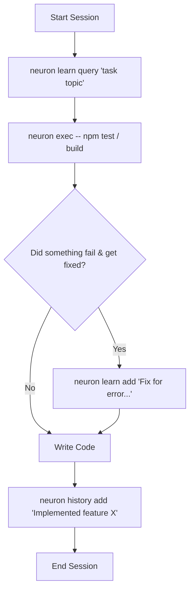

# neuron 🧠

**Persistent, local semantic memory store for AI coding agents. Zero-config, 100% offline, powered by SQLite and local vector embeddings.**

**Platforms:** macOS, Linux, Windows

[](https://www.npmjs.com/package/@kovartravis/neuron)
[](https://opensource.org/licenses/MIT)

---

## 💡 Why Neuron? (The Agent Amnesia Problem)

AI coding agents (like Claude, Cursor, Antigravity, and Codex) are incredibly powerful, but they suffer from **severe short-term amnesia**. Every time you start a new agent session, the context window resets. 

Without memory:
* **Agents repeat mistakes:** They will spend 20 minutes trying to debug a native macOS mutex lock crash before finally discovering they need a specific dependency override—only to **forget it entirely** in the next session and waste your API tokens doing the same research again.
* **Context gets bloated:** Trying to jam every project convention, database quirk, and architecture decision into a `CLAUDE.md` or `AGENTS.md` file quickly eats up their context window, resulting in slower responses and lost instructions.
* **Handoffs are broken:** There is no easy way for one agent to know what the previous agent built, changed, or left unfinished.

**Neuron solves this.** By providing an ultra-fast, local semantic database that sits in your project, neuron gives your agents a persistent brain. It lets them retrieve past context, run safe command-line dry-runs, and log actions between runs.

---

## 🚀 Killer Features

### 1. Pre-Command Rule Lookup (`neuron exec -- <command>`)
Instead of hoping your agent remembers project rules, use `neuron exec -- <command>`. Before executing the target shell command, neuron runs a local semantic search over your learnings database. If it finds rules relevant to the command (e.g., *"Always mock Stripe endpoints in vitest"* when running `npm test`), it prints them directly to `stderr` so they enter the agent's context window *right before* the command runs.

### 2. Auto-Harness Scaffolding & Detection (`neuron init`)
Running `neuron init` bootstraps your codebase for agentic memory store workflows. It automatically detects directories for popular agent harnesses (`.agents`, `.claude`, `.cursor`, `.github`, `.codex`) and copies the standard `neuron-memory` skill instruction file (`SKILL.md`) directly into their directories, teaching the agents how to use neuron automatically.

### 3. Fully Offline & Zero-Configuration
Neuron uses HuggingFace `Transformers.js` to run the `bge-small-en-v1.5` embedding model locally on your machine via ONNX runtime. The quantized model (~34 MB) is downloaded and cached once, meaning zero external API keys are required, and your code and history never leave your machine.

### 4. Lightning Fast Semantic Retrieval
Neuron uses a local SQLite database running in Write-Ahead Logging (`WAL`) mode. BGE embeddings are unit-normalized, which reduces cosine similarity calculations to simple dot products. Neuron executes searches in pure JavaScript in **under 1 ms** for under 10,000 rows.

### 5. Watermark Consolidation
Using `neuron history consolidate`, agents can query unread action logs and advance their cursor sequentially, ensuring they can pick up exactly where the last agent left off.

---

## ⚡ Quick Start

### 1. Install neuron globally
```bash
npm install -g @kovartravis/neuron
```

### 2. Bootstrap your project
Navigate to your repository and run:
```bash
neuron init
```
This will automatically:
- Detect agent harnesses and copy the `neuron-memory` skill files.
- Create or update `AGENTS.md` (or `CLAUDE.md` if present) to instruct agents to use neuron.

### 3. Let the agents run
Your agents will now read the instructions in `AGENTS.md` and use the following loop:



---

## 📖 Command Reference

### Master Commands
* **`neuron init`**: Bootstraps the project, auto-detects agent harnesses, and configures memory rules.
* **`neuron exec -- <command>`**: Runs a shell command with an automatic pre-command semantic lookup of relevant learnings.
* **`neuron status`**: Displays active database paths, project metadata, and local embedding cache health.

### `neuron learn` (Durable Rules & Conventions)
Manage instructions that the agent must remember over time.
```bash
# Store a new learning/rule
neuron learn add "Always use v1.20.1 of onnxruntime-node to avoid macOS teardown mutex crashes" --tags "onnx,macos,crash" --importance 5

# Semantically search learnings
neuron learn query "onnx runtime crash on mac"

# List recent learnings
neuron learn list --limit 10

# Update an existing learning
neuron learn update <id> "Updated text here" --importance 4

# Delete a learning
neuron learn delete <id>
```

### `neuron history` (Action Logs)
Log what has been done to keep future agents in sync.
```bash
# Log a completed action associated with a ticket
neuron history add "Migrated vector engine from Postgres to local SQLite database" --tags "db,vector" --task-id "01-db-schema-postgres"

# Semantically search past action logs
neuron history query "vector schema changes"

# List recent history logs
neuron history list --limit 20

# Consolidate history (read unread logs since last run and advance cursor)
neuron history consolidate

# Prune old, minor history logs (deletes importance <= 3 logs older than 30 days)
neuron history prune --days 30
```

---

## 🔗 Technical Specifications

* **Local Database**: Database files are stored under your OS-specific data directory (e.g., `~/.local/share/neuron/db/`) mapped to a unique hash of the project's root path.
* **WAL Mode**: SQLite runs in Write-Ahead Logging mode to support safe concurrent access.
* **Local Embeddings**: Powered by `@huggingface/transformers` running the `Xenova/bge-small-en-v1.5` model. Automatically locks out remote network access once cached.
* **AI-Parser Ready**: All CLI outputs are structured JSON designed specifically for agent parsing.

---

## License

MIT © [Travis Kovar](https://github.com/kovartravis)
