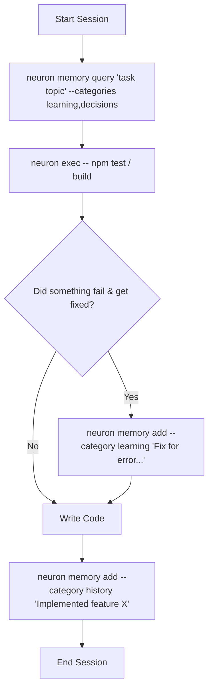

# neuron 🧠

**Persistent, local semantic memory store for AI coding agents. 100% offline, powered by SQLite and local vector embeddings.**

**Platforms:** macOS, Linux, Windows

[](https://www.npmjs.com/package/@kovartravis/neuron)
[](https://opensource.org/licenses/MIT)

---

## 💡 Why Neuron? (The Agent Amnesia Problem)

AI coding agents (like Claude, Cursor, Antigravity, and Codex) are incredibly powerful, but they suffer from **severe short-term amnesia**. Every time you start a new agent session, the context window resets. 

Without memory:
* **Agents repeat mistakes:** They will spend 20 minutes trying to debug a native macOS mutex lock crash before finally discovering they need a specific dependency override—only to **forget it entirely** in the next session and waste your API tokens doing the same research again.
* **Context gets bloated:** Trying to jam every project convention, database quirk, and architecture decision into a `CLAUDE.md` or `AGENTS.md` file quickly eats up their context window, resulting in slower responses and lost instructions.
* **Handoffs are broken:** There is no easy way for one agent to know what the previous agent built, changed, or left unfinished.

**Neuron solves this.** By providing an ultra-fast, local semantic database that sits in your project, neuron gives your agents a persistent brain. It lets them retrieve past context, run safe command-line dry-runs, and log actions between runs across user-defined categories.

---

## 🚀 Killer Features

### 1. Pre-Command Rule Lookup (`neuron exec -- <command>`)
Instead of hoping your agent remembers project rules, use `neuron exec -- <command>`. Before executing the target shell command, neuron runs a local semantic search over your configured memory categories. If it finds rules relevant to the command (e.g., *"Always mock Stripe endpoints in vitest"* when running `npm test`), it prints them directly to `stderr` so they enter the agent's context window *right before* the command runs.

### 2. Configurable Memory Categories & Pull Rules (`neuron.yaml`)
Define $N$ dynamic memory categories (`learnings`, `history`, `decisions`, `snippets`, etc.) in a `neuron.yaml` file at the root of your project. Configure `pullRules` to control which categories are queried during `neuron exec` for specific command patterns.

### 3. Auto-Harness Scaffolding & Detection (`neuron init`)
Running `neuron init` bootstraps your codebase for agentic memory store workflows. It automatically detects directories for popular agent harnesses (`.agents`, `.claude`, `.cursor`, `.github`, `.codex`) and copies the standard `neuron-memory` skill instruction file (`SKILL.md`) directly into their directories, teaching agents how to use neuron automatically.

### 4. Fully Offline & Privacy-First
Neuron uses HuggingFace `Transformers.js` to run the `bge-small-en-v1.5` embedding model locally on your machine via ONNX runtime. The quantized model (~34 MB) is downloaded and cached once, meaning zero external API keys are required, and your code and history never leave your machine.

### 5. Lightning Fast Semantic Retrieval
Neuron uses a local SQLite database running in Write-Ahead Logging (`WAL`) mode with a unified `memories` table and FTS5 keyword indexing. BGE embeddings are unit-normalized, which reduces cosine similarity calculations to simple dot products. Neuron executes searches in pure JavaScript in **under 1 ms** for under 10,000 rows.

### 6. Watermark Consolidation
Using `neuron history consolidate`, agents can query unread action logs and advance their cursor sequentially, ensuring they can pick up exactly where the last agent left off.

---

## ⚙️ Project Configuration (`neuron.yaml`)

Create a `neuron.yaml` file at the root of your project to define custom memory categories and `neuron exec` pull rules:

```yaml
version: "1.0"

# Define N dynamic memory categories (all stored in vector DB)
categories:
  learning:
    description: Agent conventions, rules, and failure fixes
    tags:
      - rule
      - convention

  history:
    description: Action history log and completed task summary

  decisions:
    description: Architectural Decision Records (ADRs) & design specs
    tags:
      - adr
      - architecture

  snippets:
    description: Reusable code snippets & command references

# Rules defining when to pull from specific categories
pullRules:
  default:
    categories:
      - learning
      - decisions
    limit: 5
    minScore: 0.35

  onExec:
    - commandPattern: ".*"
      categories:
        - learning
      limit: 5

    - commandPattern: "^(git|gh|npm) "
      categories:
        - learning
        - history
      limit: 8
```

---

## ⚡ Quick Start

### 1. Install neuron globally
```bash
npm install -g @kovartravis/neuron
```

### 2. Bootstrap your project
Navigate to your repository and run:
```bash
neuron init
```
This will automatically detect agent harnesses and copy the `neuron-memory` skill files.

### 3. Let the agents run
Your agents will read `neuron.yaml` and the `neuron-memory` skill, updating `AGENTS.md` to execute the memory loop:



---

## 📖 Command Reference

### Master Commands
* **`neuron init`**: Detects agent harnesses and copies the `neuron-memory` skill files.
* **`neuron exec -- <command>`**: Runs a shell command with automatic pre-command semantic lookup based on `neuron.yaml` pull rules.
* **`neuron status`**: Displays active database paths, project metadata, configured categories, and embedding cache health.

### `neuron memory` (Generic Memory Command across $N$ Categories)
Manage memories in any configured category.
```bash
# Add a memory to a custom category
neuron memory add "Use SQLite WAL mode for concurrency" --category decisions --tags "adr,db" --importance 4

# Query memories across categories
neuron memory query "SQLite WAL" --categories decisions,learning

# List recent memories in a category
neuron memory list --category decisions --limit 10

# Update an existing memory
neuron memory update <id> "Updated text here" --category decisions --importance 4

# Delete a memory
neuron memory delete <id> --category decisions
```

### `neuron learn` (Durable Rules & Conventions — Alias for `--category learning`)
```bash
# Store a new learning/rule
neuron learn add "Always pin onnxruntime-node to 1.20.1" --tags "onnx,macos,crash" --importance 5

# Semantically search learnings
neuron learn query "onnx runtime crash on mac"

# List recent learnings
neuron learn list --limit 10

# Update an existing learning
neuron learn update <id> "Updated text here" --importance 4

# Delete a learning
neuron learn delete <id>
```

### `neuron history` (Action Logs — Alias for `--category history`)
```bash
# Log a completed action associated with a ticket
neuron history add "Migrated vector engine to unified memories table" --tags "db,vector" --task-id "01-db-schema"

# Semantically search past action logs
neuron history query "vector schema changes"

# List recent history logs
neuron history list --limit 20

# Consolidate history (read unread logs since last run and advance cursor)
neuron history consolidate

# Prune old, minor history logs (deletes importance <= 3 logs older than 30 days)
neuron history prune --days 30
```

---

## 🔗 Technical Specifications

* **Local Database**: Database files are stored under your OS-specific data directory (e.g., `~/.local/share/neuron/db/`) mapped to a unique hash of the project's root path.
* **WAL Mode**: SQLite runs in Write-Ahead Logging mode to support safe concurrent access.
* **Local Embeddings**: Powered by `@huggingface/transformers` running the `Xenova/bge-small-en-v1.5` model. Automatically locks out remote network access once cached.
* **AI-Parser Ready**: All CLI outputs are structured JSON designed specifically for agent parsing.

---

## License

MIT © [Travis Kovar](https://github.com/kovartravis)
