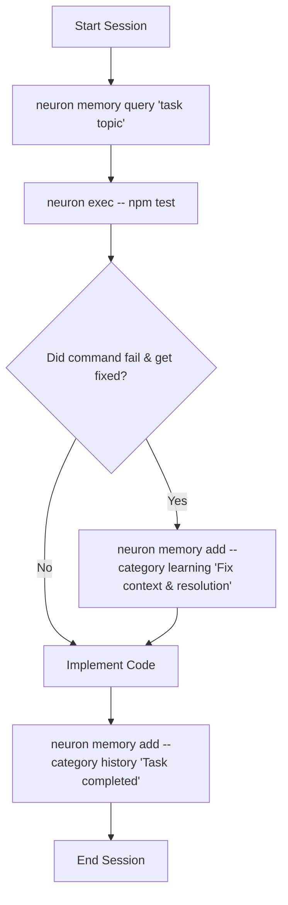

# neuron 🧠

**Persistent, local semantic memory store for AI coding agents. 100% offline, powered by native Markdown files and local vector embeddings.**

**Platforms:** macOS, Linux, Windows

[](https://www.npmjs.com/package/@kovartravis/neuron)
[](https://opensource.org/licenses/MIT)

---

## 💡 Why Neuron? (Solving Agent Amnesia)

AI coding assistants (Claude, Cursor, Antigravity, Codex) suffer from **short-term amnesia**—every session resets their context window to zero. They repeat debugging mistakes, waste tokens re-investigating known issues, and lack handoff context between sessions.

**Neuron solves this.** It provides a persistent, local memory brain inside your repository. Agents retrieve past learnings, run pre-command safety checks, and log structured context across custom categories.

---

## 🚀 Key Features

* **Flexible Storage Engines (`neuron.yaml`)**:
  * **`md-only`**: Pure native `.neuron/*.md` file storage with in-memory semantic vector search (`TransformersEmbedder` dot-product similarity) and zero `.sqlite` disk overhead.
  * **`vector-only`**: Fast local SQLite vector DB with FTS5 keyword indexing.
  * **`dual`**: Write to both SQLite vector DB and `.neuron/*.md` files.
  * **`split`**: Per-category routing (e.g. `learning` in `.md`, `history` in SQLite vector DB).
* **Agent-First Setup (`neuron init`)**: Auto-detects agent environments (`.agents`, `.claude`, `.cursor`, `.github`, `.codex`) and installs the `neuron-memory` skill.
* **Context-Aware Pre-Command Safety (`neuron exec -- <cmd>`)**: Wraps shell commands to pull relevant safety rules and warnings right before execution.
* **Bi-Directional Sync (`neuron sync`)**: Easily sync memories between `.neuron/*.md` files and the SQLite vector database.
* **100% Offline & Private**: Uses local ONNX vector embeddings (`Xenova/bge-small-en-v1.5`) via HuggingFace `Transformers.js`—zero API keys or external calls.

---

## ⚡ Quick Start

### 1. Install & Initialize
```bash
npm install -g @kovartravis/neuron
neuron init
```

### 2. Prompt your AI Agent
Open your AI coding assistant and say:
> *"Set up neuron memory for this project."*

Your agent will run the setup interview, create `neuron.yaml`, and configure `AGENTS.md` automatically.

---

## 🔄 Agent Execution Loop



---

## ⚙️ Configuration (`neuron.yaml`)

```yaml
version: "1.0"

storage:
  mode: md-only # Options: md-only, vector-only, dual, split
  path: .neuron

categories:
  learning:
    description: Agent conventions, rules, and failure fixes
    tags: [rule, convention, failure-fix]
    storage: md # Optional in split mode

  history:
    description: Action history log and completed task summary
    tags: [task, history]

  decisions:
    description: Architectural Decision Records (ADRs) & design choices
    tags: [adr, architecture]

pullRules:
  default:
    categories: [learning, decisions]
    limit: 5
    minScore: 0.35

  onExec:
    - commandPattern: ".*"
      categories: [learning]
      limit: 5
    - commandPattern: "^(git|npm|gh) "
      categories: [learning, history]
      limit: 8
```

---

## 🖥️ Local Dashboard UI (`neuron ui`)

Launch the real-time dark-mode web dashboard:
```bash
neuron ui
```
Browse categories, execute instant semantic queries, filter by scope/tags, and visually inspect memory entries.

---

## 📖 Command Reference

* **`neuron init`**: Installs skill files in agent harnesses.
* **`neuron exec -- <command>`**: Runs a command with pre-execution safety lookup.
* **`neuron memory add/query/list/update/delete`**: Multi-category operations (`--category <name>`).
* **`neuron learn add/query/list`**: Shorthand alias for `learning` category.
* **`neuron history add/query/list/prune`**: Shorthand alias for `history` category.
* **`neuron sync`**: Synchronizes memories between Markdown files and SQLite DB.
* **`neuron status`**: Displays database, Markdown storage, and embedding model status.
* **`neuron ui`**: Launches local web dashboard UI.
* **`neuron feedback [message]`**: Generates pre-filled GitHub issue creation links (`--type bug|feature|general`, `--title`).


---

## 📄 License

MIT © [Travis Kovar](https://github.com/kovartravis)
