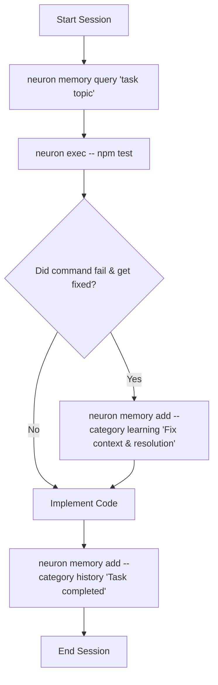

# neuron 🧠

**Persistent, local semantic memory store for AI coding agents. 100% offline, powered by native Markdown files and local vector embeddings.**

**Platforms:** macOS, Linux, Windows

[](https://www.npmjs.com/package/@kovartravis/neuron)
[](https://opensource.org/licenses/MIT)

---

## 💡 Why Neuron? (Solving Agent Amnesia)

AI coding assistants (Claude, Cursor, Antigravity, Codex) suffer from **short-term amnesia**—every session resets their context window to zero. They repeat debugging mistakes, waste tokens re-investigating known issues, and lack handoff context between sessions.

**Neuron solves this.** It provides a persistent, local memory brain inside your repository. Agents retrieve past learnings, run pre-command safety checks, and log structured context across custom categories.

---

## 🚀 Key Features

* **Flexible Storage Engines (`neuron.yaml`)**:
  * **`md-only`**: Pure native `.neuron/*.md` file storage with in-memory semantic vector search (`TransformersEmbedder` dot-product similarity) and zero `.sqlite` disk overhead.
  * **`vector-only`**: Fast local SQLite vector DB with FTS5 keyword indexing.
  * **`dual`**: Write to both SQLite vector DB and `.neuron/*.md` files.
  * **`split`**: Per-category routing (e.g. `learning` in `.md`, `history` in SQLite vector DB).
* **Architecture Scanning (`neuron scan`)**: Reads your repo's module boundaries, tech-stack manifests, and exported symbols into a single blueprint card the agent can query.
* **Drift Detection (`neuron scan --check`)**: Tells you — or your CI pipeline — when the codebase has moved away from what the agent remembers.
* **Agent-First Setup (`neuron init`)**: Auto-detects agent environments (`.agents`, `.claude`, `.cursor`, `.github`, `.codex`) and installs the `neuron-memory` skill.
* **Context-Aware Pre-Command Safety (`neuron exec -- <cmd>`)**: Wraps shell commands to pull relevant safety rules and warnings right before execution.
* **Bi-Directional Sync (`neuron sync`)**: Easily sync memories between `.neuron/*.md` files and the SQLite vector database.
* **100% Offline & Private**: Uses local ONNX vector embeddings (`Xenova/bge-small-en-v1.5`) via HuggingFace `Transformers.js`—zero API keys or external calls.

---

## ⚡ Quick Start

### 1. Install & Initialize
```bash
npm install -g @kovartravis/neuron
neuron init
```

### 2. Prompt your AI Agent
Open your AI coding assistant and say:
> *"Set up neuron memory for this project."*

Your agent will run the setup interview, create `neuron.yaml`, and configure `CLAUDE.md` (or the equivalent instructions file for your harness) automatically.

---

## 🔄 Agent Execution Loop



---

## ⚙️ Configuration (`neuron.yaml`)

```yaml
version: "1.0"

storage:
  mode: md-only # Options: md-only, vector-only, dual, split
  path: .neuron

categories:
  learning:
    description: Agent conventions, rules, and failure fixes
    tags: [rule, convention, failure-fix]
    storage: md # Optional in split mode

  history:
    description: Action history log and completed task summary
    tags: [task, history]

  decisions:
    description: Architectural Decision Records (ADRs) & design choices
    tags: [adr, architecture]

  architecture:
    description: Architectural blueprints & structure cards
    tags: [architecture, topology, scan]

scan:
  enabled: true          # Auto-scan on `neuron init`; also enables drift
                         # reporting in `neuron status` and `neuron exec`
  category: architecture # Target memory category for the blueprint card
  depth: 3               # Max directory traversal depth

pullRules:
  default:
    categories: [learning, decisions]
    limit: 5
    minScore: 0.35

  onExec:
    - commandPattern: ".*"
      categories: [learning]
      limit: 5
    - commandPattern: "^(git|npm|gh) "
      categories: [learning, history]
      limit: 8
```

---

## 🏛️ Codebase Architecture Scanning (`neuron scan`)

An agent that has never seen your repo spends its first several tool calls
rediscovering the same directory layout. `neuron scan` does that walk once and
stores the result as a queryable **Repository Architectural Blueprint** card.

The scan collects three things:

* **Module topology** — the subsystem tree, up to `--depth` levels.
* **Tech-stack manifests** — `package.json`, `Cargo.toml`, `go.mod`, `pyproject.toml`.
* **Symbol contracts** — exported classes, interfaces, structs, functions, and methods across `.ts`, `.js`, `.tsx`, `.jsx`, `.py`, `.go`, `.rs`, `.java`, `.cpp`, `.hpp`, `.cs`, `.swift`, `.rb`, and `.php`.

Each module is summarized offline by `Xenova/Qwen1.5-0.5B-Chat` and embedded
with `bge-small-en-v1.5`, so the blueprint answers semantic questions
("where does auth live?") rather than only exact-name lookups.

```bash
# Scan and ingest the blueprint into the memory store
neuron scan

# Preview the card without writing to memory
neuron scan --dry-run

# Structured JSON topology, for piping into other tools
neuron scan --dry-run --json
```

Re-running `neuron scan` **updates the existing card in place** rather than
appending a second one.

### Drift Detection (`--diff` / `--check`)

A blueprint that silently goes stale is worse than none. `--diff` compares the
live codebase against the stored card and reports variance in four buckets:
new modules, removed modules, export-contract changes, and dependency shifts.

```bash
# Human-readable drift report
neuron scan --diff

# Same comparison, but exit 1 when drift exists — for CI
neuron scan --check
```

```text
### ⚠️ Architectural Drift Detected

**Summary**: 1 new module, 3 export changes, 1 dependency shift

#### 🆕 New Modules & Subsystems (1)
- **`billing`** (`src/billing`): New module discovered

#### ⚡ Export Contract Changes (3)
- ➕ **`InvoiceService`** in `src/billing/invoice.ts` (added)
- ➖ **`legacyCharge`** in `src/payments/charge.ts` (removed)

#### 📦 Dependency Shifts (1)
- ➕ `stripe` (added)
```

Gate a pipeline on it:

```yaml
- run: neuron scan --check   # exits 1 if the blueprint is stale
```

When `scan.enabled: true` in `neuron.yaml`, drift is also surfaced passively:
`neuron status` includes a `drift` object, and `neuron exec` prints a
non-blocking warning to `stderr` before running your command. A fingerprint
guard keeps this cheap — repeated commands don't re-scan an unchanged tree.

> **On symbol extraction:** as of 2.1.0 this is line-oriented pattern matching,
> not full AST parsing. Multi-line declarations may be truncated and some call
> sites are recorded as methods. A real `web-tree-sitter` engine is planned;
> see [ADR 0003](docs/adr/0003-web-tree-sitter-architecture-scanner.md).

---

## 🖥️ Local Dashboard UI (`neuron ui`)

Launch the real-time dark-mode web dashboard:
```bash
neuron ui
```
Browse categories, execute instant semantic queries, filter by scope/tags, and visually inspect memory entries.

---

## 📖 Command Reference

* **`neuron init`**: Bootstraps project, pre-downloads local ONNX models with a terminal progress bar, and runs the initial scan if configured.
* **`neuron exec -- <command>`**: Runs a command with pre-execution safety lookup, plus a drift warning when `scan.enabled`.
* **`neuron scan`**: Scans codebase topology and ingests the architectural blueprint. Flags: `--category`, `--depth`, `--dry-run`, `--diff`, `--check`, `--format json|md`, `--json`, `--no-progress`. `--check` exits `0` in sync, `1` on drift, `2` when the baseline was produced by a different parser and must be re-baselined (see ADR 0009).
* **`neuron memory add/query/list/update/delete/consolidate/prune`**: Multi-category operations. `--category` is required for `add`, `delete`, and `update`; `query` and `list` span categories by default and accept `--categories a,b`.
* **`neuron sync`**: Synchronizes memories between Markdown files and SQLite DB (`--dry-run`, `--force`).
* **`neuron status`**: Displays database, Markdown storage, embedding model, and architectural drift status as JSON.
* **`neuron ui`**: Launches local web dashboard UI.
* **`neuron feedback [message]`**: Generates pre-filled GitHub issue creation links (`--type bug|feature|general`, `--title`).
* **`neuron learn …`** / **`neuron history …`**: *Deprecated.* Thin aliases that delegate to `neuron memory --category learning|history` and warn on `stderr`. Removed in 3.0.0.

Run `neuron --help`, `neuron scan --help`, or `neuron memory --help` for full flag listings.

---

## 🧪 Testing & Benchmarks

```bash
npm test          # unit + integration suite, ~5s
npm run test:e2e  # 6-pillar deep E2E benchmark & correctness suite
npm run bench:view # open the HTML scorecard
```

`test:e2e` runs the **real** pipeline — the ONNX embedder and the Qwen
summarizer, not the test stubs — across polyglot AST traversal at scale,
adversarial semantic recall, high-concurrency multi-agent stress, drift
detection latency, storage corruption self-healing, and pipeline integrity.
It requires a warm local ONNX model cache; a cold cache makes the first run
substantially longer. See [ADR 0007](docs/adr/0007-deep-e2e-benchmark-suite-matrix.md).


---

## 📄 License

MIT © [Travis Kovar](https://github.com/kovartravis)
