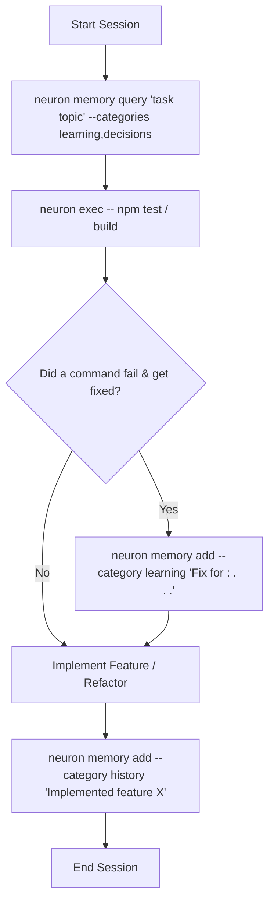

# neuron 🧠

**Persistent, local semantic memory store for AI coding agents. 100% offline, powered by SQLite and local vector embeddings.**

**Platforms:** macOS, Linux, Windows

[](https://www.npmjs.com/package/@kovartravis/neuron)
[](https://opensource.org/licenses/MIT)

---

## 💡 Why Neuron? (The Agent Amnesia Problem)

AI coding agents (such as Claude, Cursor, Antigravity, and Codex) are powerful pair programmers, but they suffer from **severe short-term amnesia**. Every time a new session starts, the context window resets to zero.

Without persistent memory:
* **Agents repeat mistakes:** They spend 20 minutes debugging a native macOS mutex crash or dependency conflict—only to **forget the solution entirely** in the next session and waste API tokens repeating the same investigation.
* **Context windows get bloated:** Cramming every codebase rule, database quirk, and architecture decision into a `CLAUDE.md` or `AGENTS.md` file consumes valuable context window space, slowing down responses and causing forgotten instructions.
* **Agent handoffs are broken:** There is no standard mechanism for one agent to discover what a previous agent built, refactored, or left unfinished.

**Neuron solves this.** By providing a local, category-driven vector database inside your repository, neuron gives your agents a persistent brain. Agents can retrieve past context, execute pre-command safety lookups, and log learnings across user-defined categories.

---

## 🚀 Killer Features

### 1. Configurable $N$ Dynamic Memory Categories (`neuron.yaml`)
Forget rigid, hardcoded memory schemas. Define any number of custom memory categories (`learning`, `history`, `decisions`, `snippets`, `architecture`, etc.) directly in `neuron.yaml`. Each category supports custom default tags and descriptions.

### 2. Context-Aware Pre-Command Lookup (`neuron exec -- <command>`)
Instead of hoping your agent remembers project rules before running tests or builds, wrap shell calls with `neuron exec -- <command>`. `neuron exec` evaluates `pullRules.onExec` regex patterns in `neuron.yaml` (e.g. matching `npm test` or `git commit`), queries relevant categories, and streams matching rules to `stderr` *right before* the command executes.

### 3. Skill-Driven Agent Harness Integration (`neuron init`)
Running `neuron init` automatically detects popular agent harness environments (`.agents`, `.claude`, `.cursor`, `.github`, `.codex`) and copies the standard `neuron-memory` skill file (`SKILL.md`). The skill guides agents to generate `neuron.yaml` and configure instruction files (`AGENTS.md`, `CLAUDE.md`, etc.) tailored to your project.

### 4. Rich Multi-Sentence Memory Capture
Neuron promotes comprehensive, multi-sentence memory entries (minimum 3–4 sentences) covering **Context & Symptoms**, **Root Cause**, **Verified Solution**, and **Code/Command Examples**. This prevents vague 1-sentence summaries and ensures high-utility context retrieval for future agents.

### 5. Unified Vector & FTS5 Hybrid Search Engine
Neuron uses a local SQLite database running in Write-Ahead Logging (`WAL`) mode with a unified `memories` table, local BGE vector embeddings (`Xenova/bge-small-en-v1.5`), and FTS5 full-text indexing. Reciprocal Rank Fusion (RRF) merges semantic and keyword search results in **under 1 ms** for under 10,000 rows.

### 6. 100% Offline & Privacy-First
All embeddings run locally using HuggingFace `Transformers.js` via ONNX runtime. The quantized model (~34 MB) is cached once locally—zero API keys required, zero telemetry, and your code and prompt history never leave your machine.

---

## ⚙️ Project Configuration (`neuron.yaml`)

Configure your project's memory categories and `neuron exec` pull rules in `neuron.yaml` at your project root:

```yaml
version: "1.0"

# Define N dynamic memory categories (all vector-embedded in SQLite)
categories:
  learning:
    description: Agent conventions, rules, and failure fixes
    tags:
      - rule
      - convention

  history:
    description: Action history log and completed task summary

  decisions:
    description: Architectural Decision Records (ADRs) & design specs
    tags:
      - adr
      - architecture

  snippets:
    description: Reusable code snippets & command references

# Rules defining when to pull from specific categories
pullRules:
  default:
    categories:
      - learning
      - decisions
    limit: 5
    minScore: 0.35

  onExec:
    - commandPattern: ".*"
      categories:
        - learning
      limit: 5

    - commandPattern: "^(git|gh|npm) "
      categories:
        - learning
        - history
      limit: 8
```

---

## ⚡ Quick Start

### Step 1: Install neuron globally
```bash
npm install -g @kovartravis/neuron
```

### Step 2: Bootstrap your project
In your project directory, run:
```bash
neuron init
```
This detects existing harness directories (`.agents`, `.claude`, `.cursor`, etc.) and installs the bundled `neuron-memory` skill.

### Step 3: Create `neuron.yaml`
Create `neuron.yaml` at your project root (or let your agent create it automatically via the `neuron-memory` skill).

### Step 4: Configure your agent instruction file (`AGENTS.md`)
Add the 4-step memory store protocol to `AGENTS.md` (or `CLAUDE.md` / `CURSOR.md`):

```markdown
## Memory Store Protocol (@kovartravis/neuron)

1. FIRST ACTION: Query active categories before starting work:
   neuron memory query "<task topic>" --categories learning,decisions

2. PRE-COMMAND LOOKUP: Wrap critical build/test/git commands:
   neuron exec -- npm test

3. FAILURE-FIX RECORDING: Record 3-4 sentence detailed resolutions on failure:
   neuron memory add --category learning "Fix for <error>: <context>. <root cause>. <fix>." --tags failure-fix

4. SESSION CONCLUSION: Log action history upon completion:
   neuron memory add --category history "<summary of work completed>" --task-id <ticket-id>
```

### Step 5: Execute the Agent Memory Loop



---

## 📖 Command Reference

### Master Commands
* **`neuron init`**: Detects agent harnesses (`.agents`, `.claude`, `.cursor`, `.github`, `.codex`) and installs skill files.
* **`neuron exec -- <command>`**: Runs a shell command with pre-command semantic lookup based on `neuron.yaml` pull rules.
* **`neuron status`**: Displays database status, project root, active categories count, and local embedding model health.

### `neuron memory` (Primary Multi-Category CLI Suite)
Manage entries across any category defined in `neuron.yaml`:
```bash
# Add an entry to a custom category
neuron memory add "Use SQLite WAL mode for concurrency" --category decisions --tags "adr,db" --importance 4

# Query memories across categories
neuron memory query "SQLite WAL" --categories decisions,learning

# List recent memories in a category
neuron memory list --category decisions --limit 10

# Update an entry in-place
neuron memory update <id> "Updated text content" --category decisions --importance 5

# Delete an entry by ID
neuron memory delete <id> --category decisions
```

### `neuron learn` (Shorthand Alias for `--category learning`)
```bash
# Store a new learning/rule
neuron learn add "Fix for CLI exec resource leak: always call memory.close() in exec subcommand before spawning child processes to avoid holding open SQLite handles." --tags "failure-fix,cli" --importance 4

# Semantically search learnings
neuron learn query "cli resource leak"

# List recent learnings
neuron learn list --limit 10

# Update a learning
neuron learn update <id> "Updated learning text" --importance 4

# Delete a learning
neuron learn delete <id>
```

### `neuron history` (Shorthand Alias for `--category history`)
```bash
# Log a completed action associated with a ticket
neuron history add "Implemented neuron.yaml config loader and unified memories table v5" --tags "db,config" --task-id "01-config"

# Semantically search action history
neuron history query "config loader"

# List recent history logs
neuron history list --limit 20

# Consolidate history (read unread logs since last run and advance watermark cursor)
neuron history consolidate

# Prune old, minor history logs (deletes importance <= 3 logs older than 30 days)
neuron history prune --days 30
```

---

## 🔗 Technical Specifications

* **Database Engine**: Single unified `memories` SQLite table with indexed `category` column, running in Write-Ahead Logging (`WAL`) mode.
* **Hybrid Search**: Combines semantic vector search (`Xenova/bge-small-en-v1.5` 384-dimensional Float32Array embeddings) and keyword-exact search (`memories_fts` FTS5 virtual table) aggregated using Reciprocal Rank Fusion (RRF).
* **Local Embeddings**: `@huggingface/transformers` running ONNX runtime locally. Once downloaded (~34 MB), remote network requests are disabled.
* **Structured Output**: All CLI outputs are formatted as clean JSON Line arrays for effortless agent parsing.

---

## License

MIT © [Travis Kovar](https://github.com/kovartravis)
