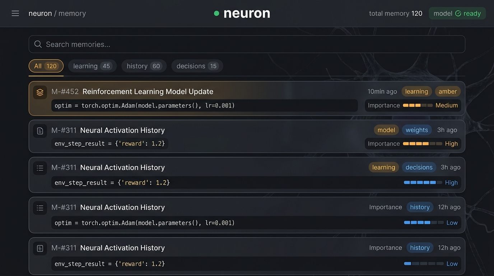

# neuron 🧠

**Your AI coding agent's memory, as plain markdown files in your repo — and a CLI that refuses to let it write a malformed one.**

[](https://www.npmjs.com/package/@kovartravis/neuron)
[](https://opensource.org/licenses/MIT)

**Platforms:** macOS, Linux, Windows

---

## The problem: agent memory you can't see or review

Most persistent-memory tools for AI coding agents store what they've learned in
a database or a compiled index — something you'd need a special viewer or CLI
query to inspect. That's powerful, but it also means the thing shaping your
agent's behavior lives somewhere you can't casually open, diff, or review in a
pull request.

**Neuron takes the opposite approach.** Everything your agent learns —
conventions, past fixes, decisions, project notes — is stored as plain
`.neuron/*.md` files, right in your repo. Open them in any editor. Read them
top to bottom. Edit a line by hand if the agent got something wrong. Review
changes to them the same way you review changes to code, in a normal git diff.

But "tell an agent to append to a `.md` file" is a prompt, not a product —
anyone can write that instruction, and nothing stops the agent from writing
back whatever it wants. The part that makes markdown-as-memory a real
guarantee rather than a suggestion: **an agent using the Neuron CLI cannot
write an entry that violates your schema.** Declare that every `decisions`
entry needs a `ticket` and a `reviewedBy`, and the CLI refuses the write
without them — no matter what the agent's prompt says.

## What makes Neuron different

- 📄 **Markdown is the store of record.** By default, memory lives as
  `.neuron/*.md` files — human-readable, git-diffable, hand-editable. SQLite
  is kept underneath as a rebuildable semantic-search index, reconciled from
  the markdown on every command; delete it and Neuron rebuilds it from your
  files. It also lives outside your repo entirely, in a per-machine cache
  directory — nothing to commit, nothing to `.gitignore`.
- 🔒 **Your agent can't write a malformed entry.** Declare required and
  enum-typed fields per category in `neuron.yaml`, and every write — from the
  CLI or from `neuron scan` — is checked against that schema before it lands.
  A write that skips a required field, or sends a value outside a declared
  enum, is refused with an error naming exactly what's missing.
- 🔌 **Deterministic recall, not a hope the agent remembers to look.** On
  Claude Code and OpenAI Codex CLI, `neuron init` wires a hook that queries
  memory and injects results before the model ever sees the prompt — the
  harness runs it, not the agent's judgment. Other harnesses fall back to a
  `CLAUDE.md`/`AGENTS.md` instruction asking the agent to query the store
  itself.
- 🏛️ **Architecture as a deterministic markdown artifact.** `neuron scan`
  parses your codebase with real Tree-Sitter ASTs and writes a single
  blueprint card that stays byte-identical across runs until the code
  actually changes — a `git diff` you can gate CI on, not a tool you have to
  query.
- 🔒 **100% offline & private** — local ONNX embeddings, no API keys, no
  cloud calls. Your code and your memory never leave your machine.

This isn't a claim to be the most powerful codebase-analysis engine
available — there are tools built for deep structural analysis (call graphs,
cross-service linking, large-monorepo indexing) if that's what you need.
Neuron is for developers who want their agent's memory, and its picture of
the codebase, to be something they fully own and can inspect in plain text.

## 🚀 Quick start

```bash
# Install globally
npm install -g @kovartravis/neuron

# Initialize in your project (detects CLAUDE.md/AGENTS.md, pre-downloads local models)
neuron init

# Save a note the agent should remember
neuron memory add --category learning "Always use the Repository Pattern for database access in src/services"

# Search stored memory
neuron memory query "How do we handle database access?"
```

Then tell your agent:

> "Set up neuron memory for this project."

It runs the setup interview and configures the project for you.

### Recall is enforced, not requested

On a supported harness, `neuron init` wires a hook that queries memory and
injects results before the model sees the prompt — no instruction for the
agent to follow, no dependence on it choosing to look. `neuron init` itself
reports this per project, per harness — a `detected / wired / fidelity` line
plus what to do about it, read from each harness's real hook registration
(`verify()`), not inferred from a config file existing.

**What the fidelity labels mean:**
- **Deterministic** — every injecting hook point has a known payload cap,
  failure posture and timeout; recall refreshes every turn, guaranteed.
- **Best-effort** — real, harness-executed injection, but with at least one
  undocumented edge (a payload cap, a failure mode, or a missing per-turn
  hook point) that keeps it short of the deterministic guarantee.
- **Instruction-only** — no hook point on this harness ever injects context
  into the model; recall depends entirely on the model choosing to read
  `CLAUDE.md`/`AGENTS.md` and run `neuron memory query` itself.

| Harness | Mechanism | Fidelity |
|---|---|---|
| Claude Code | `SessionStart` / `UserPromptSubmit` / `PreCompact` hooks, every turn | Deterministic |
| OpenAI Codex CLI | `SessionStart` / `UserPromptSubmit` / `PreCompact` hooks, every turn | Deterministic |
| GitHub Copilot CLI | `sessionStart` hook only — no per-turn hook point exists on this harness | Best-effort — guarantees the architecture card once, at session start; verified against a real Copilot CLI installation |
| Cursor | `sessionStart` / `preCompact` hooks — no per-turn hook point exists on this harness | Best-effort — guarantees the architecture card once, at session start; **not verified against a real Cursor installation** (no maintainer access — see [ticket 22](.scratch/neuron-2.3.0/issues/22-verify-cursor-adapter-real-install.md)), shipped on fixture/documentation evidence only |
| Anything else (`AGENTS.md` fallback) | No hook adapter | Instruction-only — the model must choose to read `AGENTS.md` and run `neuron memory query` itself |

*Verified against each harness's documented hook behavior as of 2026-08-10.
This matrix is static and harnesses change their own hook contracts without
notice — treat "verified" as "true when last checked," not "guaranteed
going forward."*

### Your git history is a searchable resident source too

On the two harnesses with a per-turn hook (Claude Code, Codex CLI), every
prompt is also matched against an index of your repo's own commit history —
subject and body, embedded and searched the same way memory content is,
gated so an unrelated prompt surfaces nothing rather than a weak guess. The
index backfills once on first use, then stays current incrementally (a
`git rev-parse HEAD` check against the last-indexed commit) — no git hook to
install, nothing to silently fall out of sync. It's additive and bounded:
roughly 1,000 characters per turn, carved out of the same per-epoch budget
the rest of recall already respects, never a separate cost.

Two things worth knowing before you rely on it:
- **Ticket/issue numbers in commit messages can collide** across concurrent
  planning efforts that both call something "ticket 14" — the index has no
  way to disambiguate them, and says so in what it injects. Verify against
  `git log`/`git show` yourself before trusting a specific number.
- **It's shipped and dogfooded, not yet independently re-measured.** An
  earlier prototype (hand-picked, oracle search terms) showed a favorable
  result, but the real mechanism — semantic embedding match, not keyword
  search — turned out to need its own measurement; that re-run hasn't
  landed yet. Treat it as "surfaces real, correct commits" (confirmed live
  against this repo's own history), not yet as a quantified improvement.

Copilot CLI and Cursor don't get this — both only have a session-start hook,
and there's no prompt to match against until the first per-turn hook fires.

## 📁 What it looks like in your repo

```
.neuron/
  learning.md      # conventions, rules, failure fixes
  history.md       # action history log
  decisions.md     # architectural decision records
```

Open any of them. They're just markdown, with a small YAML frontmatter block
per entry:

```markdown
# Category: decisions

---
id: e9d606cd-0d61-4073-9da8-1675c6d7adfd
createdAt: 2026-08-05T15:02:38.494Z
importance: 3
tags: []
taskId: null
reviewedBy: alice
ticket: NEU-42
---
Chose Postgres over SQLite for concurrent writes
```

Readable, greppable, diffable, and safe to hand-edit if something needs
correcting — a missing or malformed value on a pre-existing entry is reported
by `neuron status`, never silently guessed at.

## ⚙️ Configuration (`neuron.yaml`)

This is exactly what `neuron init` generates for a new project — not a
hand-maintained example that can drift from what actually ships:

```yaml
version: "1.0"

# Your memory lives in markdown. SQLite is kept as a rebuildable index that is
# reconciled from these files on every command — the .md files are the record.
#   md      markdown is authoritative, vector index derived from it (default)
#   vector  local SQLite vector DB with FTS5 only, no .md files
# Any category below may set its own "storage:" to override this just for it.
# Precedence: categories.<name>.storage > storage.mode > "md".
storage:
  mode: md
  path: .neuron

categories:
  # Any category below may set its own "path:" to override storage.path just
  # for it (e.g. "path: docs/adr" to keep decisions.md alongside other docs).
  # Precedence: categories.<name>.path > storage.path > ".neuron".
  learning:
    description: Agent conventions, rules, and failure fixes
    tags: [rule, convention, failure-fix]

  history:
    description: Action history log and completed task summary
    tags: [task, history]

  decisions:
    description: Architectural Decision Records (ADRs) & design choices
    tags: [adr, architecture, design]

  architecture:
    description: Architectural blueprints & structure cards
    tags: [architecture, topology, scan]

# Set enabled: true to scan on init and to surface drift in
# 'neuron status' and 'neuron exec'. Writes into the category named below,
# which must be one of the categories declared above.
scan:
  enabled: false
  category: architecture
  depth: 3

pullRules:
  default:
    categories: [learning, decisions]
    limit: 5

  onExec:
    - commandPattern: ".*"
      categories: [learning]
      limit: 5
```

Storage modes:

- **`md`** (default) — markdown is authoritative. SQLite is present as a
  rebuildable semantic-search index, kept in sync by a reconcile pass that
  runs on every command (measured overhead: ~6.5ms on a 264-entry store).
  Delete the database and Neuron rebuilds it from your `.md` files.
- **`vector`** — SQLite only, no `.md` files, for projects that don't want
  files on disk at all. Carries the identical schema guarantee via an
  additive, non-destructive column migration.

`vector-only` and `split` are deprecated spellings from before 2.3.0 — both
still parse (with a stderr warning) rather than erroring on upgrade.
`vector-only` aliases to `vector`. `split` aliases to `md`, since the
per-category override below is what `split` used to gate and is now always
live regardless of the top-level mode.

### Per-category storage path

A category's markdown doesn't have to live under the project-wide
`storage.path`. Set `path` on the category itself to send just that one
elsewhere — a shared notes directory, or `decisions.md` living next to your
other docs:

```yaml
storage:
  mode: md
  path: .neuron

categories:
  decisions:
    description: Architectural Decision Records (ADRs) & design choices
    path: docs/adr   # overrides storage.path for this category only
  learning:
    description: Agent conventions, rules, and failure fixes
```

Precedence is `categories.<name>.path > storage.path > ".neuron"` — a
category with no `path` set still falls through to `storage.path`, and a
project with no `storage.path` set still falls through to `.neuron`, exactly
as before. Absolute paths are allowed (e.g. a notes directory shared across
projects, outside this repo). Two categories may resolve to the same
directory; they may not resolve to the same file.

If you edit a category's `path` after entries already exist under the old
one, the old `.md` file is **not** moved or deleted — Neuron re-exports that
category from its SQLite index into the new location on the next command,
and leaves the old file exactly where it was. Move or remove it yourself
once you've checked the new one looks right.

### Per-category storage mode

Set `storage` on a category to override the top-level `storage.mode` just for
it — e.g. keep `history` in reviewable markdown while routing a
high-volume category straight to SQLite:

```yaml
storage:
  mode: md
  path: .neuron

categories:
  learning:
    description: Agent conventions, rules, and failure fixes
  telemetry:
    description: High-volume, low-value entries
    storage: vector   # this category alone skips markdown
```

Precedence is `categories.<name>.storage > storage.mode > "md"`. If a
category's storage flips from `md` to `vector` and it already has an existing
`.md` file, that file is left on disk untouched but stops being updated —
Neuron warns once on stderr so it doesn't go stale unnoticed.

### The guarantee in practice: declaring required fields

Add a `fields` block to any category to make specific frontmatter fields
mandatory, and the CLI both enforces them and exposes them as flags:

```yaml
categories:
  decisions:
    description: Architectural Decision Records (ADRs) & design choices
    fields:
      ticket:
        type: string
        required: true
      reviewedBy:
        type: enum
        values: [alice, bob]
        required: true
```

```bash
$ neuron memory add --category decisions "Chose Postgres over SQLite"
Error: --ticket is required for category "decisions" (neuron.yaml categories.decisions.fields.ticket). Pass --ticket <value>, or add a "default:" in neuron.yaml.

$ neuron memory add --category decisions --ticket NEU-42 --reviewed-by alice "Chose Postgres over SQLite"
{"id":"e9d606cd-0d61-4073-9da8-1675c6d7adfd","status":"created","project":"neuron"}
```

Only `string` and `enum` field types are supported — a closed vocabulary
covers the common team-convention case (a status or reviewer field) without
opening the door to a value the CLI can't validate. This is **shape and byte
determinism**: every entry conforms to the schema, and serializes
identically. It is not *value* determinism — auto-tagging and category
inference select from store state, so the same command can choose different
tag values a month apart. An opt-in `strict: true` disables both, if you need
the same input to always produce the same output.

## 📖 Command reference

| Command | Description |
|---|---|
| `neuron init` | Bootstraps the project, pre-downloads local ONNX models, fetches Tree-Sitter grammars, wires recall hooks |
| `neuron memory add/query/list/update/delete/consolidate/prune` | Multi-category memory operations, backed by plain `.md` files by default |
| `neuron exec -- <command>` | Runs a command with pre-execution safety lookup pulled from stored memory, and a non-blocking drift warning if the codebase moved |
| `neuron scan` / `scan --diff` / `scan --check` | Ingests an architectural blueprint card; reports drift; exits non-zero in CI on real drift |
| `neuron sync` | Explicit forced rebuild between markdown and SQLite, for categories resolving to `md` — ordinary commands already reconcile automatically |
| `neuron status` | Displays storage, embedding model, drift and relevance-gate status as JSON |
| `neuron ui` | Launches the local dashboard |
| `neuron feedback [message]` | Generates pre-filled GitHub issue links (`--type bug\|feature\|general`) |

Declared fields extend this automatically — `neuron memory --help` lists
`--ticket`, `--reviewed-by`, or whatever your `neuron.yaml` declares, so an
agent reading `--help` learns your project's schema without it needing to be
restated anywhere else. Run `neuron --help`, `neuron scan --help`, or
`neuron memory --help` for full flag listings.

### Scheduled and cron writers

`neuron memory add`'s write-time supersession gate normally hard-blocks a
near-duplicate write and asks an interactive caller to re-run with
`--supersedes <id>` or `--not-a-reversal` — a human loop a cron job or CI
writer can't complete. Pass `--if-novel` instead: on a gate hit it skips the
write (exit 0, job still succeeds) rather than erroring, and it is never
silent about it — the skip is printed to stderr and noted in the JSON result
(`{"skipped": true, "reason": "supersession-candidate", ...}`) so a
duplicate-prevention failure never gets buried in a log a human never reads.

## 🏛️ Architecture awareness, as a deterministic artifact

The same idea extended to your codebase's structure: `neuron scan` is a
deterministic way to get your architecture into a markdown file that stays
up to date, rather than something you re-derive by re-reading the repo every
session.

```bash
neuron scan                    # scan and ingest the blueprint
neuron scan --dry-run          # preview without writing to memory
neuron scan --diff             # human-readable drift report
neuron scan --check            # non-zero exit on drift — for CI gates
```

Symbols come from a real, parsed Tree-Sitter syntax tree — not a regex
guess — across **TypeScript, TSX, JavaScript, Python, Go, Rust, Java and
C++** (8 grammars, 10 extensions). "Lightweight" describes the scope, not the
parsing: an export contract is a contract. `.cs`, `.swift`, `.rb` and `.php`
fall back to a line-oriented scanner until they get a grammar; every card
records which parser produced each file, so the two are never silently
compared as if they meant the same thing.

The card itself is byte-identical across repeated scans of an unchanged
tree, and a re-scan updates the one card in place rather than creating a
duplicate — so `git diff` on `.neuron/architecture.md` shows real drift, not
scan-to-scan noise.

This is a supporting feature, not the core pitch: if you need deep
structural analysis — call graphs, cross-service linking, large-monorepo
indexing — there are tools purpose-built for that. Neuron's scan stays
intentionally lightweight and produces a plain file, like everything else
here.

```yaml
- run: neuron scan --check
```

## 📊 Measured, not just claimed

Most memory tools assert they help. We ran a real counterfactual — same
Claude Sonnet 5 agent, same tasks, memory hook on vs. off — and let a
grading script decide, not us.

**The first run found a real regression, not a win.** 24 sessions (4 tasks
× 2 arms × 3 repeats): no measured token difference, and the memory arm
failed *more often* than the no-memory control (33% vs 17%). Root cause: a
superseded decision in `.neuron/decisions.md` was outranking the entry that
reversed it — the agent trusted stale advice because nothing marked it
stale.

**We fixed the cause, then re-measured.** [Memory
supersession](docs/adr/0015-memory-supersession.md) hard-blocks a write
that looks like a near-duplicate of an existing entry until the agent
resolves it, then excludes the superseded row from recall by default.
Re-running the two tasks that actually regressed: memory-arm failure
dropped from 67% to **0%**, beating the control's unchanged 33%.

**Then we built a cleaner instrument and measured the token claim
properly — and this time it's a win.** The earlier runs dogfooded this
repo, where the control arm could stumble onto an answer in ordinary docs.
So we rebuilt the fixture on **real SWE-bench Lite instances**: actual
matplotlib and Django checkouts pinned to a commit *before* the real fix
landed, where the answer is structurally absent. Same agent, same task,
same deterministic grader — the only difference is whether neuron's
session-start hook put a relevant memory in context.

| Task | Without neuron | With neuron | Reduction |
|---|---|---|---|
| `matplotlib-24265` | 26,076 tokens | **6,933** | **73.4%** |
| `django-11019` | 12,458 tokens | **9,354** | 24.9% |
| **Pooled** | **19,267** | **8,144** | **57.7%** |

**16 of 16 sessions answered correctly in both arms** — the saving isn't
bought with worse answers. On `matplotlib-24265` the two arms separate
completely (Mann-Whitney U=0, exact p=0.029): every neuron session finished
in exactly 2 turns, every control session took 4–5. Cost per run halved,
$0.46 → $0.22.

Worth knowing what that number is and isn't. It measures the value of a
**correct** recall — the fixture injects a relevant entry, so real-world
benefit still depends on retrieval quality against a full store. `django-11019`'s
24.9% doesn't reach significance on its own. And at 4 repeats this design
resolves a ~50% effect, not a 20% one. Full numbers, statistics, and the
caveats we're still chasing are in
[`findings.md`](benchmarks/token-ab/results/19-synthetic-fixture-counterfactual-ab/findings.md).

One more result we'd rather publish than bury: measured as **files alone**
— store on disk, agent free to ignore it — the same task landed at 12,552
tokens, roughly half the benefit, because the agent sometimes just didn't
look. Recall being *enforced* rather than *requested* is doing real work
here, and it's why the hook exists.

**The harness is real and runnable**, not a one-off script we deleted
after. It's documented in
[`benchmarks/token-ab/README.md`](benchmarks/token-ab/README.md), including
how to add tasks and how to avoid the ways it has misled us:

```bash
npm run bench:swebench-ab:dry-run                        # free — validates fixtures + grading
npm run bench:swebench-ab -- --k=4 --effort=low --cap=2.0  # the run above: ~$0.70, ~15 min
```

Every session's full answer text, token breakdown, and per-gate grade is
written to `results.json`, so you can re-grade our verdicts offline without
spending anything — and disagree with them.

### The full benchmark report

This section cherry-picks the highlights. Every token-economics finding —
`07`'s session budget, `08`'s injection-redundancy audit, both counterfactual
A/Bs above, and what hasn't been run yet — lives alongside the retrieval
pillars in one generated report, each number labeled **established** or
**not run**, never rounded toward a claim:

```bash
npm run bench:report   # free, ~10s — re-renders from the result files already in this repo
npm run bench:view     # same, then opens benchmarks/reports/index.html
```

That regenerates the report from evidence already committed to this repo —
nothing to spend. To re-earn any one number yourself, the A/B's own command
is next to its number above (or in
[`benchmarks/token-ab/README.md`](benchmarks/token-ab/README.md)); the
retrieval pillars behind it re-run via `npm run test:e2e` (sanity tier,
minutes) or `npm run bench` (full tier, longer, real ONNX embedding +
summarization).

## 🖥️ Local dashboard

```bash
neuron ui
```



Browse categories, run instant semantic queries, filter by tags, and inspect
drift reports — all served locally.

## 🧪 Testing

```bash
npm test          # unit + integration suite, ~7s
npm run test:e2e  # deeper E2E benchmark & correctness suite
```

## 📚 Documentation

- **[Command reference](https://github.com/kovartravis/neuron/blob/main/docs/COMMANDS.md)**
  — every command, flag, exit code, and the full `neuron.yaml` schema
- **[Architecture decision records](https://github.com/kovartravis/neuron/tree/main/docs/adr)**
  — why it's built the way it is
- **[Changelog](https://github.com/kovartravis/neuron/blob/main/CHANGELOG.md)**
  — including upgrade notes

## 📄 License

MIT © [Travis Kovar](https://github.com/kovartravis)
