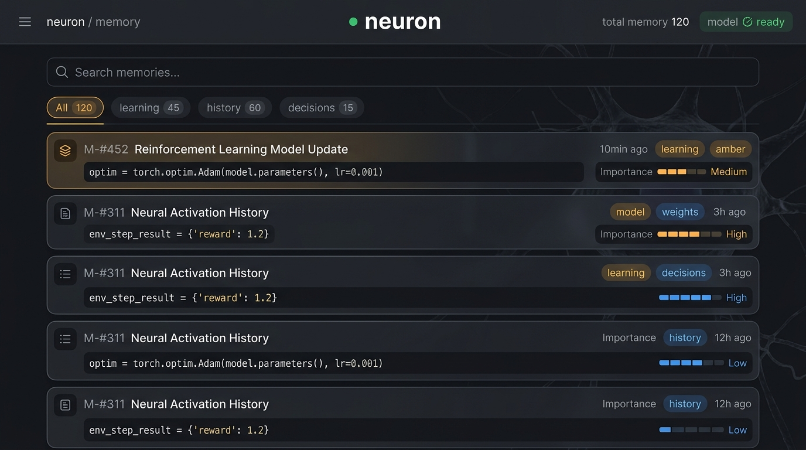

# neuron 🧠

**Shared memory for your team's coding agents.** Every fix, convention and
decision recorded once — as markdown in the repo, reviewed in pull requests,
and injected automatically into Claude Code, Codex, Cursor and Copilot when
it's relevant.

[](https://www.npmjs.com/package/@kovartravis/neuron)
[](https://www.npmjs.com/package/@kovartravis/neuron)
[](https://github.com/kovartravis/neuron/actions/workflows/ci.yml)
[](package.json)
[](https://opensource.org/licenses/MIT)

**Website & docs:** [kovartravis.github.io/neuron](https://kovartravis.github.io/neuron/) ·
**Works with:** Claude Code, OpenAI Codex CLI, Cursor, GitHub Copilot CLI, any MCP client ·
**Platforms:** macOS, Linux, Windows

---

## Your coding agent makes the same mistake twice. Your teammate's agent makes it a third time.

Every session starts from zero. The flaky test gets re-debugged, the
convention gets re-explained, the "we tried that, it didn't work" decision
gets re-litigated — and whatever your agent did learn stays on your machine,
invisible to the rest of the team and to review.

neuron fixes both halves. The agent records what it learns into
`.neuron/*.md` files in the repo, under a schema you declare. The harness —
not a prompt the model can skip — injects the relevant entries back into
every teammate's session, on every tool, when they matter.

## Three commands

```bash
curl -fsSL https://raw.githubusercontent.com/kovartravis/neuron/main/install.sh | sh   # or: npm install -g @kovartravis/neuron
cd your-project && neuron init      # detects your harness, wires the recall hooks, downloads the local models

neuron memory add --category learning "Fix for ECONNRESET in the integration suite: the mock server binds before the port is released; sleep 200ms after teardown."
neuron memory query "flaky integration test"
```

That's the whole surface most days: `init` once, `add` when something is
worth remembering, and `query` — which the hook runs for you. Everything else
is reference material.

This is what the next session sees, verbatim, from a Claude Code hook in
this repository — the turn *after* a fix was recorded:

```text
$ npm test
PreToolUse:Bash hook additional context:
- [learning] Fix for a false-positive Bash-command match in the ticket-07
  hint-follow instrument: recordToolUse's QUERY_COMMAND_PATTERN was a bare
  substring test, so any Bash command that merely quoted the phrase got
  logged as a real query invocation. Fixed by anchoring the pattern to a
  shell separator (…)
```

The store behind it is a markdown file in the repo. Open
[`.neuron/learning.md`](.neuron/learning.md) — that's the real one.

## Why not just…

- **…a `CLAUDE.md` / `AGENTS.md`?** It's one file, read in full on every
  prompt whether it's relevant or not, and nobody prunes it. neuron injects
  only the entries that clear a relevance gate and enforces structure on
  what goes in. Keep your `CLAUDE.md` for standing instructions; neuron
  handles what the agent *learns*.
- **…Claude Code's or Cursor's built-in memory?** That memory lives in your
  home directory, per user, per machine
  (`~/.claude/projects/<repo>/memory/` for Claude Code — [docs](https://code.claude.com/docs/en/memory)).
  Your teammate's agent never sees it, and it never appears in a pull
  request. neuron's memory is the team's: in the repo, in the diff, on every
  harness.
- **…Mem0 or Zep?** Those are hosted APIs for general-purpose agents. neuron
  is offline, in git, and built only for coding agents.
- **…nothing?** Measured on real SWE-bench Lite tasks with the same agent,
  memory hook on vs. off: **57.7% fewer tokens**, and every session in both
  arms answered correctly. [Details below.](#-measured-not-just-claimed)

## What makes it the team's memory, not one person's

- 📄 **It's in the repo.** `.neuron/*.md` — human-readable, git-diffable,
  hand-editable. SQLite sits underneath as a disposable semantic-search
  index, rebuilt from the markdown automatically, in a per-machine cache.
  Nothing to commit, nothing to `.gitignore`.
- 🔍 **It's reviewed.** A memory change lands in the same pull request as
  the code change that motivated it. Reviewers see three new lines in
  `.neuron/learning.md` next to the fix — and can reject them.
- 🔒 **It's governed.** Declare that every `decisions` entry needs a
  `ticket` and a `reviewedBy` from an enum, and the write is refused without
  them — from a human or an agent, no matter what the prompt says.
- 🔌 **It's injected, not requested.** On Claude Code and Codex CLI,
  `neuron init` wires hooks so the harness itself runs the lookup on every
  prompt and before every shell command. No agent judgment call required.
  Cursor and Copilot CLI get it at session start; anything MCP-aware gets
  `neuron mcp`.
- 🎯 **It's relevance-gated.** Every candidate clears a lexical filter, then
  a local ONNX cross-encoder reranker, before it's injected. On the hardest
  out-of-corpus test we could build, that cut the false-accept rate from
  99.80% to 19.4%.
- 🔒 **It's offline.** Local ONNX embeddings, no API keys, no cloud calls,
  ever.

Also in the box, for when you want them: `neuron scan` writes a
Tree-Sitter-derived architecture card you can gate CI on (`scan --check`),
and your git history is indexed and searched with the same relevance gate
as your notes. Both are covered further down.

### Set it up for a team

```yaml
# neuron.yaml
categories:
  learning:
    description: Fixes and conventions the agent should remember
  decisions:
    description: Design choices — who signed off, and against which ticket
    fields:
      ticket:     { type: string, required: true }
      reviewedBy: { type: enum, values: [alice, bob, ci-bot], required: true }
```

```bash
$ neuron memory add --category decisions "Chose Postgres over SQLite"
Error: --ticket is required for category "decisions" (neuron.yaml categories.decisions.fields.ticket). Pass --ticket <value>, or add a "default:" in neuron.yaml.
```

Commit `neuron.yaml` and `.neuron/` and every clone — and every teammate's
agent — is on the same schema and the same memory from the first session.

### How it compares

| | `CLAUDE.md` / `AGENTS.md` | Harness built-in memory | Hosted memory API (Mem0, Zep, …) | **neuron** |
|---|---|---|---|---|
| Where memory lives | One growing prose file | Your home directory | Behind a vendor API | Markdown in your repo |
| Shared with the team | Yes, if committed | No | Via the vendor | Yes — it's in git |
| Works across harnesses | Per file name | No | Via SDK | Claude Code, Codex, Cursor, Copilot, MCP |
| What enters each prompt | The whole file, every time | First N lines of an index | Whatever the API returns | Only what clears a relevance gate |
| Structure | None | None | Vendor schema | Your schema, enforced at write time |
| Reviewing changes | `git diff` | Not reviewable | Vendor dashboard | `git diff`, same as code |
| Offline / no account | Yes | Yes | No | Yes |
| Recall is guaranteed | Only if the model reads it | Only if the model reads it | Only if the agent calls it | The harness hook runs it |

Named, sourced comparisons — Mem0, Zep, claude-mem, agentmemory, Beads — are on the
[alternatives page](https://kovartravis.github.io/neuron/docs/alternatives/).

## 📦 Install

```bash
# Standalone binary (macOS/Linux) — no Node.js required
curl -fsSL https://raw.githubusercontent.com/kovartravis/neuron/main/install.sh | sh

# npm (requires Node.js >= 22.13)
npm install -g @kovartravis/neuron
```

```powershell
# PowerShell (Windows) — standalone binary, no Node.js required
powershell -c "irm https://raw.githubusercontent.com/kovartravis/neuron/main/install.ps1 | iex"
```

Both paths are fully supported. Installed via curl/PowerShell? `neuron
upgrade` self-updates the binary. Installed via npm? `npm update -g
@kovartravis/neuron`.

Then, in your project, `neuron init` — or just tell your agent:

> "Set up neuron memory for this project."

It runs the setup interview, configures the project, and migrates anything
already in your `CLAUDE.md` / `AGENTS.md` into structured entries if you
want it to.

## Recall your agent can't skip

`neuron init` wires a hook directly into your harness — the harness itself
runs the memory query and injects the result before the model sees the
prompt. No instruction to forget, no judgment call to skip. `neuron init`
reports exactly what got wired, per harness, straight from each harness's
real hook registration.

| Harness | How recall lands |
|---|---|
| **Claude Code** | Every turn, automatically — hooked into `SessionStart`, `UserPromptSubmit`, and `PreCompact` |
| **OpenAI Codex CLI** | Every turn, automatically — same three hook points |
| **GitHub Copilot CLI** | Once per session, automatically — the harness only exposes a session-start hook |
| **Cursor** | Once per session, automatically — same session-start-only constraint |
| **Anything else** | Instruction-based fallback via `AGENTS.md`, prompting the agent to query the store itself |

Full fidelity details, including exactly which hook points each harness
supports, are in [`docs/COMMANDS.md`](docs/COMMANDS.md).

### Your git history is a searchable resident source too

On the two harnesses with a per-turn hook, every prompt is also matched
against an index of your repo's own commit history — subject and body,
embedded and searched the same way memory content is. Ask about a feature
or a bug, and the commit that actually shipped the fix surfaces alongside
your notes. It backfills once and stays current incrementally — no git
hook to install, nothing to fall out of sync.

Live-measured against the real semantic search mechanism: it matched a
hand-tuned oracle's 0% failure rate and clearly beat an agent manually
running `git log` on its own (11.1% failure). Full numbers in
[`benchmarks/token-ab/results/11-rerun-gitlog-ab-semantic-mechanism/findings.md`](benchmarks/token-ab/results/11-rerun-gitlog-ab-semantic-mechanism/findings.md).

### Command execution gets the same treatment

`neuron exec -- <command>` — a pre-execution memory lookup — doesn't have
to be a manual step either. On Claude Code and Codex CLI, `neuron init`
wires a `pre-command` hook that fires automatically on every shell tool
call, surfacing a relevant hit as context instead of requiring the agent to
remember to ask. Purely informational — it never blocks the command.

### Write-side compliance gets a nudge, not just a reminder

Recall solves reading memory back; it doesn't make an agent write to it in
the first place. An A/B test measured that gap directly: under realistic
multi-step conditions, an agent with no nudge recorded a fix only 20% of the
time it should have. `neuron init` wires a `pre-stop` hook that fires when
the agent is about to end its turn, and — once per session — forces one more
turn with a reminder if nothing has been recorded yet:

| Harness | Mechanism |
|---|---|
| **Claude Code** | `Stop` — forces a continuation, empirically verified |
| **OpenAI Codex CLI** | `Stop` — forces a continuation, per documentation |
| **GitHub Copilot CLI** | `agentStop` — forces a continuation, per documentation |
| **Cursor** | `stop`'s `followup_message` — auto-submits a continuation, per documentation |

Full fidelity details are in [`docs/COMMANDS.md`](docs/COMMANDS.md).

## 📁 What it looks like in your repo

```
.neuron/
  learning.md      # conventions, rules, failure fixes
  decisions.md     # architectural decision records
```

Open any of them. They're just markdown, with a small YAML frontmatter block
per entry:

```markdown
# Category: decisions

---
id: e9d606cd-0d61-4073-9da8-1675c6d7adfd
createdAt: 2026-08-05T15:02:38.494Z
importance: 3
tags: []
taskId: null
reviewedBy: alice
ticket: NEU-42
---
Chose Postgres over SQLite for concurrent writes
```

Readable, greppable, diffable, and safe to hand-edit — `neuron status`
catches anything that ends up missing or malformed, so nothing is ever
silently guessed at.

**This isn't a toy example.** Neuron dogfoods itself: this repository's own
[`.neuron/learning.md`](.neuron/learning.md),
[`.neuron/decisions.md`](.neuron/decisions.md), and
[`.neuron/architecture.md`](.neuron/architecture.md) are the real store this
project's own agent sessions read from and write to on every release. Open
them to see real usage, not a curated demo.

## ⚙️ Configuration (`neuron.yaml`)

This is exactly what `neuron init` generates for a new project:

```yaml
version: "1.0"

# Your memory lives in markdown. SQLite is kept as a rebuildable index that is
# reconciled from these files on every command — the .md files are the record.
#   md      markdown is authoritative, vector index derived from it (default)
#   vector  local SQLite vector DB with FTS5 only, no .md files
# Any category below may set its own "storage:" to override this just for it.
# Precedence: categories.<name>.storage > storage.mode > "md".
storage:
  mode: md
  path: .neuron

categories:
  # Any category below may set its own "path:" to override storage.path just
  # for it (e.g. "path: docs/adr" to keep decisions.md alongside other docs).
  # Precedence: categories.<name>.path > storage.path > ".neuron".
  learning:
    description: Agent conventions, rules, and failure fixes
    tags: [rule, convention, failure-fix]

  decisions:
    description: Architectural Decision Records (ADRs) & design choices
    tags: [adr, architecture, design]

  architecture:
    description: Architectural blueprints & structure cards
    tags: [architecture, topology, scan]

# Set enabled: true to scan on init and to surface drift in
# 'neuron status' and 'neuron exec'. Writes into the category named below,
# which must be one of the categories declared above.
scan:
  enabled: false
  category: architecture
  depth: 3

pullRules:
  default:
    categories: [learning, decisions]
    limit: 5

  onExec:
    - commandPattern: ".*"
      categories: [learning]
      limit: 5
```

**Two storage modes.** `md` (the default) keeps markdown authoritative,
with SQLite as a rebuildable semantic-search index — delete the database
any time and Neuron rebuilds it from your files. `vector` skips markdown
entirely for projects that want no files on disk at all, same schema
guarantee either way.

### Per-category storage path

A category's markdown doesn't have to live under the project-wide
`storage.path`. Set `path` on the category itself to send just that one
elsewhere — a shared notes directory, or `decisions.md` living next to your
other docs:

```yaml
storage:
  mode: md
  path: .neuron

categories:
  decisions:
    description: Architectural Decision Records (ADRs) & design choices
    path: docs/adr   # overrides storage.path for this category only
  learning:
    description: Agent conventions, rules, and failure fixes
```

Precedence is `categories.<name>.path > storage.path > ".neuron"`. Absolute
paths work too — a notes directory shared across projects, even outside
this repo.

### Per-category storage mode

Set `storage` on a category to override the top-level `storage.mode` just
for it — keep `learning` in reviewable markdown while routing a high-volume
category straight to SQLite:

```yaml
storage:
  mode: md
  path: .neuron

categories:
  learning:
    description: Agent conventions, rules, and failure fixes
  telemetry:
    description: High-volume, low-value entries
    storage: vector   # this category alone skips markdown
```

### The guarantee in practice: declaring required fields

Add a `fields` block to any category to make specific frontmatter fields
mandatory, and the CLI both enforces them and exposes them as flags:

```yaml
categories:
  decisions:
    description: Architectural Decision Records (ADRs) & design choices
    fields:
      ticket:
        type: string
        required: true
      reviewedBy:
        type: enum
        values: [alice, bob]
        required: true
```

```bash
$ neuron memory add --category decisions "Chose Postgres over SQLite"
Error: --ticket is required for category "decisions" (neuron.yaml categories.decisions.fields.ticket). Pass --ticket <value>, or add a "default:" in neuron.yaml.

$ neuron memory add --category decisions --ticket NEU-42 --reviewed-by alice "Chose Postgres over SQLite"
{"id":"e9d606cd-0d61-4073-9da8-1675c6d7adfd","status":"created","project":"neuron"}
```

Every entry conforms to your schema, and serializes identically every
time — real, enforced structure, not a convention your agent might forget.

## 📖 Command reference

| Command | Description |
|---|---|
| `neuron init` | Bootstraps the project, pre-downloads local ONNX models, fetches Tree-Sitter grammars, wires recall hooks |
| `neuron memory add/query/list/get/update/delete/consolidate/prune` | Multi-category memory operations, backed by plain `.md` files by default. `list --where`/`--refs-satisfy` filter on any declared field — schema-agnostic, no field name baked into the CLI |
| `neuron exec -- <command>` | Runs a command with a pre-execution safety lookup pulled from stored memory, plus a non-blocking drift warning if the codebase moved |
| `neuron scan` / `scan --diff` / `scan --check` | Ingests an architectural blueprint card; reports drift; exits non-zero in CI on real drift |
| `neuron sync` | Explicit forced rebuild between markdown and SQLite — ordinary commands already reconcile automatically |
| `neuron status` / `status --health` / `status --check` | Storage, embedding model, drift and relevance-gate status as JSON; `--health` reports near-duplicate groups and store-hygiene signals (`--repair` auto-merges what's safe to); `--check` validates against your declared schema |
| `neuron ui` | Launches the local dashboard |
| `neuron mcp` | Runs an MCP server (stdio transport) exposing `neuron_remember`/`neuron_recall`/`neuron_query_exec` to any MCP-aware client |
| `neuron feedback [message]` | Generates pre-filled GitHub issue links |

Declared fields extend this automatically — `neuron memory --help` lists
`--ticket`, `--reviewed-by`, or whatever your `neuron.yaml` declares, so an
agent reading `--help` learns your project's schema without it being
restated anywhere else. Full flag listings: [`docs/COMMANDS.md`](docs/COMMANDS.md).

### Scheduled and cron writers

`neuron memory add`'s write-time supersession gate normally hard-blocks a
near-duplicate write and asks an interactive caller to resolve it — a human
loop a cron job can't complete. Pass `--if-novel` instead: on a gate hit it
skips the write cleanly (exit 0, job still succeeds) rather than erroring,
and it's never silent about it — the skip is printed to stderr and noted in
the JSON result.

## 🔌 MCP server

Claude Code and Codex CLI already get neuron's recall deterministically,
re-injected every turn via the hook model above — `neuron mcp` isn't a
replacement for that. It's for editors with no per-turn hook point (Cursor,
Windsurf, Zed, Claude Desktop, Roo Code), and it's available unconditionally
to every client, hook-covered or not.

`neuron mcp` runs an MCP server over the standard stdio transport, built on
the official `@modelcontextprotocol/sdk`, exposing three tools — thin
wrappers over the exact same store methods the CLI itself calls, not a
second logic path:

| Tool | Wraps | Notes |
|---|---|---|
| `neuron_remember` | `memory add` | `content`, `category`, `importance`, `supersedes`, `companion_of` — tags stay server-inferred, never model-settable |
| `neuron_recall` | `memory query` | `query`, `categories` — returns `{ results, rejected }`, so an empty result set reads differently from an empty store |
| `neuron_query_exec` | `exec`'s pre-command lookup | `command_text` — lookup only, never spawns the command |

No separate auth/scoping layer: a local stdio server is a subprocess your
editor spawns directly, inheriting exactly the OS-level access any CLI
invocation already has.

`neuron init` writes this client config for you — `.mcp.json` (Claude Code,
GitHub Copilot CLI), `.cursor/mcp.json` (Cursor), and `.codex/config.toml`
(Codex CLI, as a `[mcp_servers.neuron]` table) — for every detected harness,
the same run that wires recall hooks. On a harness with no deterministic
hook, the generated instructions file's Recall step also switches to calling
`neuron_recall` directly once its MCP config is wired, rather than asking the
model to shell out. See [`docs/COMMANDS.md`](docs/COMMANDS.md#neuron-init) for
the full per-harness path table and the conflict/overwrite policy (identical
to the hook install's own `--overwrite-hooks`/`--keep-hooks`).

This tool-call path is best-effort, not deterministic — a live A/B
([`docs/design/rule-recall-ab/findings.md`](docs/design/rule-recall-ab/findings.md))
found agent-invoked `neuron_recall` with no hook backing it under-complied
in every session it was tested (called only 5/8 times, never compliant even
when called). It's still strictly additive reach for editors with no hook
point at all, not a regression from some deterministic baseline they'd
otherwise have.

To point a client at it by hand instead — no separate binary, no new `bin`
entry:

```json
{
  "mcpServers": {
    "neuron": {
      "command": "npx",
      "args": ["-y", "@kovartravis/neuron", "mcp"]
    }
  }
}
```

## 🏛️ Architecture awareness, as a deterministic artifact

`neuron scan` turns your codebase's structure into a markdown file that
stays current, instead of something your agent has to re-derive by
re-reading the repo every session.

```bash
neuron scan                    # scan and ingest the blueprint
neuron scan --dry-run          # preview without writing to memory
neuron scan --diff             # human-readable drift report
neuron scan --check            # non-zero exit on drift — for CI gates
```

Real, parsed Tree-Sitter syntax trees — not a regex guess — across
**TypeScript, TSX, JavaScript, Python, Go, Rust, Java and C++**. `.cs`,
`.swift`, `.rb` and `.php` fall back to a line-oriented scanner until they
get a grammar, and every card records which parser produced each file.

The card is byte-identical across repeated scans of an unchanged tree, and
a re-scan updates it in place — so `git diff` on `.neuron/architecture.md`
shows real drift, not scan-to-scan noise.

```yaml
- run: neuron scan --check
```

## 📊 Measured, not just claimed

We ran a real counterfactual — same agent, same tasks, memory hook on vs.
off — on actual SWE-bench Lite instances (real matplotlib and Django
checkouts pinned before the real fix landed, so the answer is structurally
absent without help) and let a deterministic grader decide.

| Task | Without neuron | With neuron | Reduction |
|---|---|---|---|
| `matplotlib-24265` | 26,076 tokens | **6,933** | **73.4%** |
| `django-11019` | 12,458 tokens | **9,354** | 24.9% |
| **Pooled** | **19,267** | **8,144** | **57.7%** |

**16 of 16 sessions answered correctly in both arms** — the savings aren't
bought with worse answers. On `matplotlib-24265` the two arms separate
completely: every neuron session finished in exactly 2 turns, every
control session took 4–5. Cost per run roughly halved, $0.46 → $0.22.

A narrower follow-up isolated just the architecture card the session-start
hook pushes proactively:

| Task | Without the card | With the card | Reduction |
|---|---|---|---|
| Module/subsystem inventory | 29,244 tokens | **5,112** | **82.5%** |
| Dependency list | 8,906 tokens | 9,994 | -12% (noise) |

Naming a project's module boundaries is a judgment call a directory listing
doesn't hand you for free — the card earns its keep there. Listing npm
dependencies is cheap either way, so the card doesn't move that number.

**Every harness here is real and re-runnable**, documented in
[`benchmarks/token-ab/README.md`](benchmarks/token-ab/README.md):

```bash
npm run bench:swebench-ab:dry-run                          # free — validates fixtures + grading
npm run bench:swebench-ab -- --k=4 --effort=low --cap=2.0  # the run above: ~$0.70, ~15 min
```

Every session's full answer text, token breakdown, and per-gate grade is
written to `results.json`, so you can re-grade the verdicts yourself.

```bash
npm run bench:report   # free, ~10s — re-renders from the result files already in this repo
npm run bench:view     # same, then opens benchmarks/reports/index.html
```

## 🖥️ Local dashboard

```bash
neuron ui
```



Browse categories, run instant semantic queries, filter by tags, and inspect
drift reports — all served locally.

## 🧪 Testing

```bash
npm test          # unit + integration suite, ~7s
npm run test:e2e  # deeper E2E benchmark & correctness suite
```

## 📚 Documentation

- **[Website](https://kovartravis.github.io/neuron/)** — install, quickstart,
  per-harness setup guides (Claude Code, Codex CLI, Copilot CLI, Cursor), and
  how-it-works pages on hybrid search, the relevance gate, and the schema
- **[Command reference](https://github.com/kovartravis/neuron/blob/main/docs/COMMANDS.md)**
  — every command, flag, exit code, and the full `neuron.yaml` schema
- **[Architecture decision records](https://github.com/kovartravis/neuron/tree/main/docs/adr)**
  — why it's built the way it is
- **[Changelog](https://github.com/kovartravis/neuron/blob/main/CHANGELOG.md)**
  — including upgrade notes
- **[Releasing](https://github.com/kovartravis/neuron/blob/main/docs/RELEASING.md)**
  — the checklist for cutting a release

## 🤝 Contributing

Bug reports with a reproduction, a harness you use that neuron doesn't fit
yet, a doc page that was wrong when you needed it, or code — all welcome.
[`CONTRIBUTING.md`](CONTRIBUTING.md) has the setup, the repository map, and
the handful of rules that keep the store markdown-first.
`neuron feedback --type bug "what happened"` opens a pre-filled issue.

## 📄 License

MIT © [Travis Kovar](https://github.com/kovartravis)
